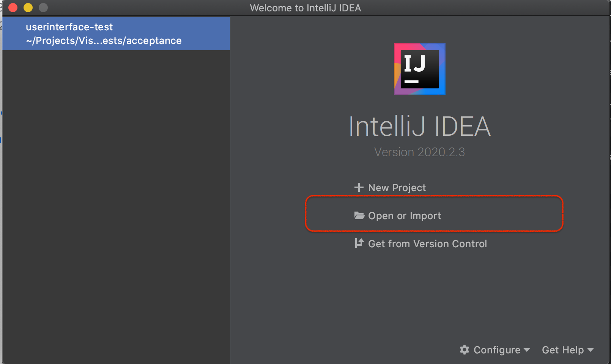
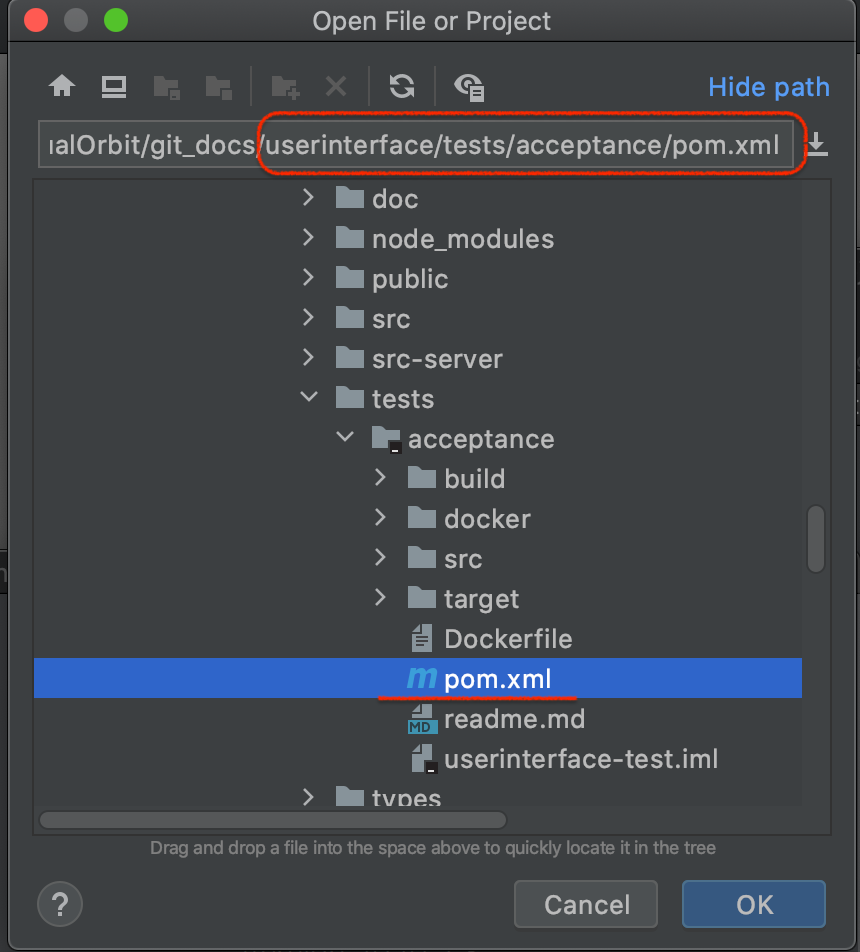
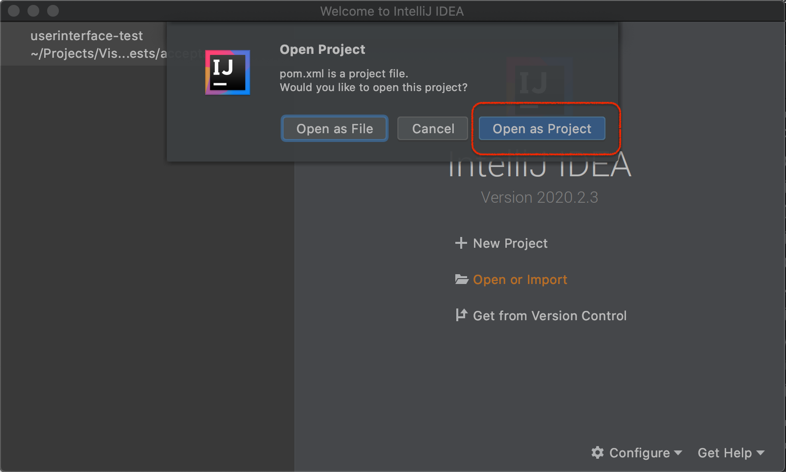
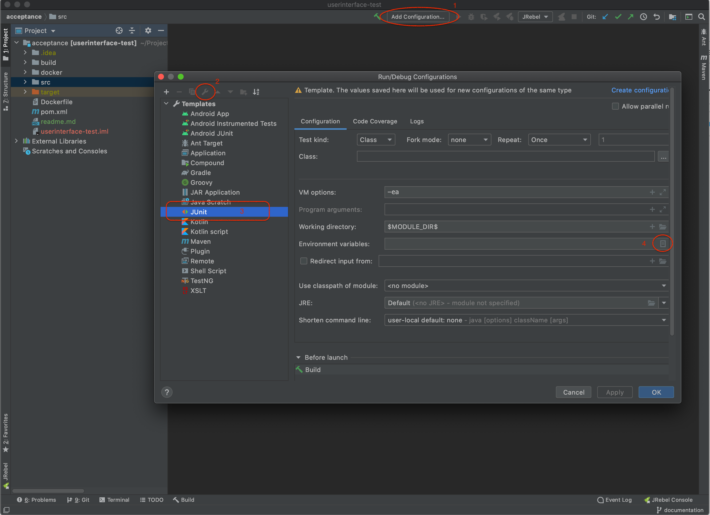
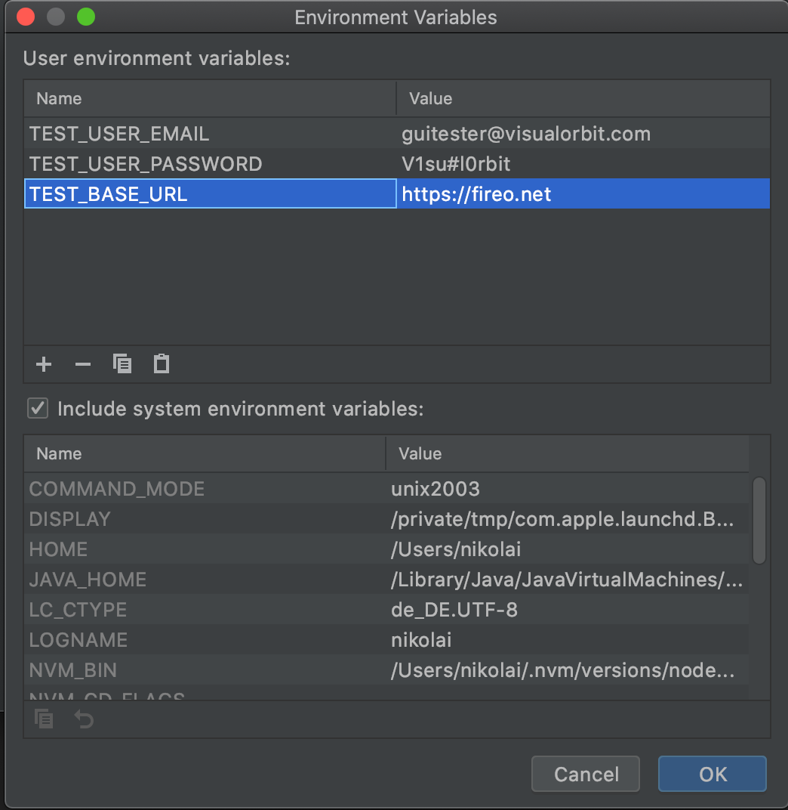
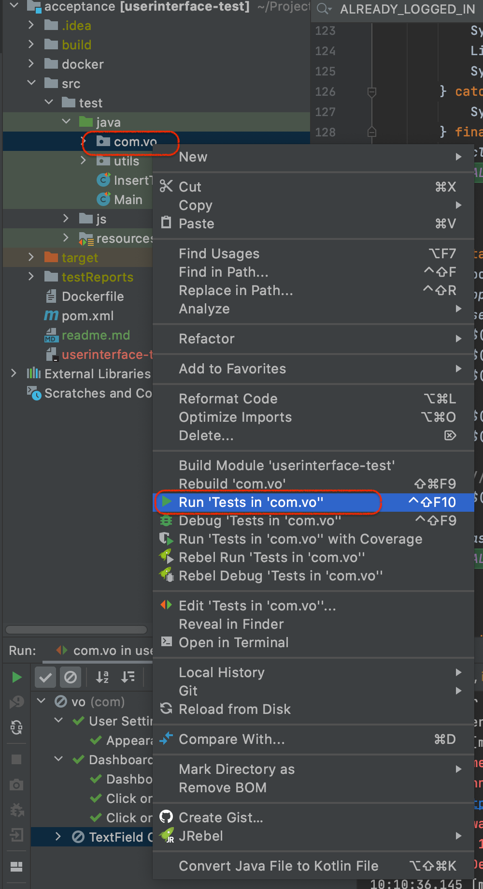
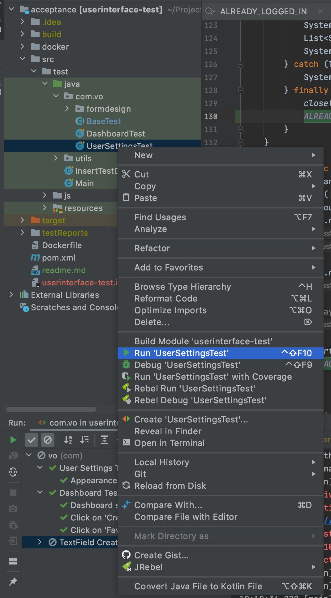
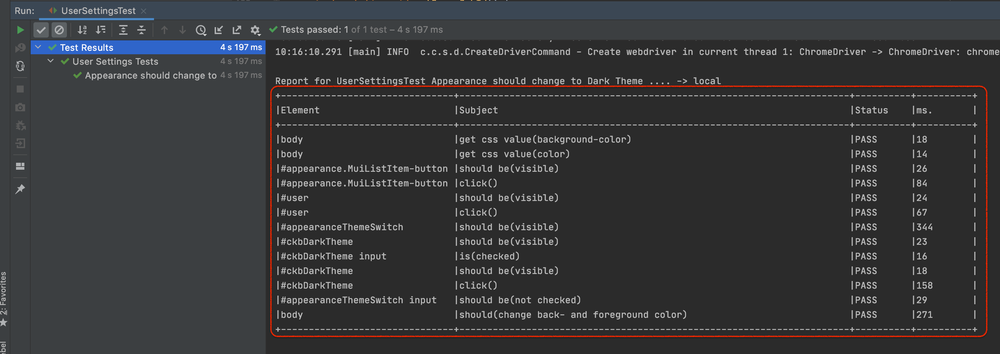
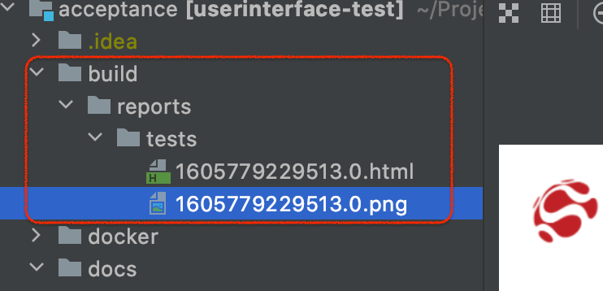

# Prerequisite

Test automation is written in Java and based on following technologies and frameworks. Please get familiar with them: 
* [Maven](https://maven.apache.org/) 
* [JUnit](https://junit.org/junit5/) 
* [Selenium](https://www.selenium.dev/documentation/en/)
* [Selenide](https://selenide.org/)

Local test execution is usually using a local installed Chrome browser. In CI/CD Pipelines we are using SauceLabs multi-browser support. The tests are running in CI/CD side inside docker container.

For best practices please check the [Selenide project](https://selenide.org/quick-start.html)

## Setup IDE

* Download and install [Intellij IDEA Community Edition](https://www.jetbrains.com/idea/download/) (recommended). You can as well use Eclipse or NetBeans or something else, but it is on your own.

* Import/open test project from userinterface as Maven project:  
Select 'Open or Import':  
[](docs/readme/01_import_project.png)  
Select pom.xml file inside the test automation project folder:  
[](docs/readme/02_select_pom_file.png)  
Open as Project:  
[](docs/readme/03_open_as_project.png)

* Setup few environment variables in Run/Debug Configurations via templates. This will add defined environment variables to all tests later.  
Create new JUnit Run/Debug Template:  
[](docs/readme/04_edit_junit_template_environment_variables.png)  
Fill environment variables. Instead of test user you can use your personal account. Please do not share your password and do not commit it anywhere!
[](docs/readme/05_env_variables.png)  
Example values: 
```
TEST_USER_EMAIL=guitester@visualorbit.com;  TEST_USER_PASSWORD=V1su#l0rbit;  
TEST_BASE_URL=https://visualorbit.fireo.net
```

## Running Tests in IDE

* Run all tests inside `vo.com` package:  
[](docs/readme/06_start_all_tests.png)

* Run specific test by selecting the test class:  
[](docs/readme/07_start_specific_test.png)

* Each test produces a report in a simple table ascii format and generates screenshots  
Table report:  
[](docs/readme/08_test_report.png)  
Screenshots in `buld/reports/tests` folder  
[](docs/readme/09_test_screenshots_html.png)


## Best practices to write concise tests
1. Few lines as possible
2. Always chain element selectors with expectations and after that with actions. e.G.  
`$("#someId").shouldBe(visible).click()`
3. Always use following technics to select elements  
   1. search for application related element ids. If not exists, ask developers to add it 
   2. search for application related element css classes. If not exists, ask developers to add it
   3. if previous two points not possible (always check and follow up with developers first) use generated locators by chrome plugins (see later)
   4. as last fallback use xpath selectors. But they should be written in an relative manner and be safe against possible movements on the page.

### Locating elements on the web page
Install following browser extensions to your Chrome browser:  
* [ChroPath](https://chrome.google.com/webstore/detail/chropath/ljngjbnaijcbncmcnjfhigebomdlkcjo?hl=en) - to easier lookup for CSS Selectors.  
* [XPath Helper](https://chrome.google.com/webstore/detail/xpath-helper/hgimnogjllphhhkhlmebbmlgjoejdpjl?hl=en) - to test XPath expressions on te page.  
* [Selenium IDE](https://chrome.google.com/webstore/detail/selenium-ide/mooikfkahbdckldjjndioackbalphokd?hl=en) - to make recordings and produce first approaches to skript the test.
